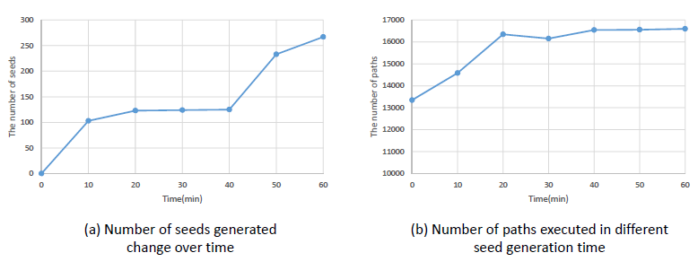

# DeepFuzzer

## Summary

DeepFuzzer is a fuzzer which combines qualified seed generation, balanced seed selection, hybrid seed mutation and automatic fuzzing environment configuration.

DeepFuzzer is an extension of AFL which is written and maintained by Michal Zalewski <[lcamtuf@google.com](mailto:lcamtuf@google.com)>, so its basic usage is like AFL, which can be found in http://lcamtuf.coredump.cx/afl/.  

To generate high-quality seeds, please use the tool in seed_generation directory. Besides that, if you want to open the balanced seed selection, please add the -F option. And you can also use –D option to open the hybrid seed mutation. We also supply the –P option  to open power schedule, this is another optimization for AFL to calculate the mutation times of a seed. These functions are closed in default, and you can combine them as you like. We believe that in most cases, opening all of them  is the best option. 

## Some intermediate results

**Number of seeds generated over time and the corresponding number of paths executed for fuzzing pcre2.**

Let xi be the hit count of the rarest branch for the seed si, n be the number of branches.  gamma is a constant, which diminishes the skip probability equally to increase efficiency. The optimized fair skip probability for seed si is:

**The number of paths and branches for fuzzing pcre2 when gamma is assigned different values.**

Let s denote the selected seed that needs to be mutated next, p(s) denote the energy of s , and p AFL (s) denote the original energy calculated by AFL. Given the number of times c(s) which s has previously been chosen from the queue S and the hit number h(s) of the rarest branch covered by s , DeepFuzzer computes p(s) as

**The number of paths and branches for fuzzing pcre2 when beta is assigned different values.**

**Influence of each component**

**Evaluation on ten programs of Google fuzzer-test-suite for 24 hours with one core**

**Performance for different fuzzers on fuzzing pcre2 24 hours with one core**

